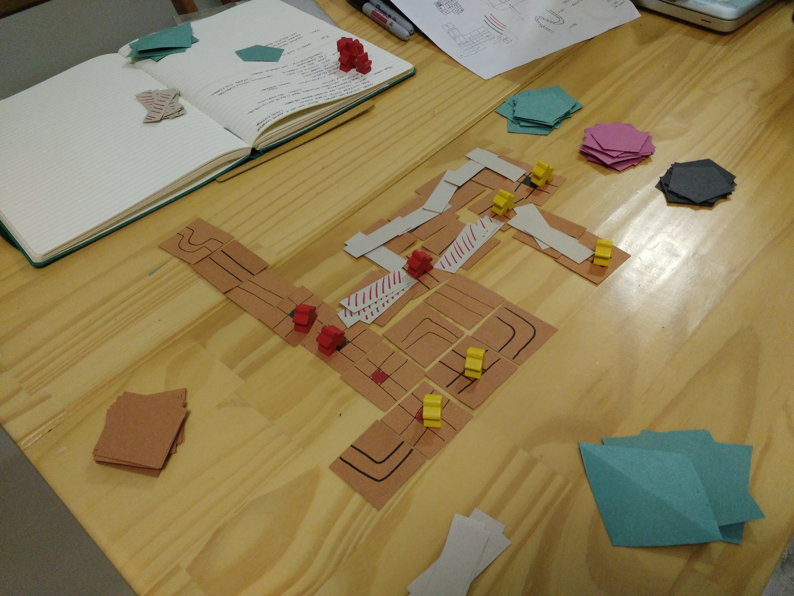
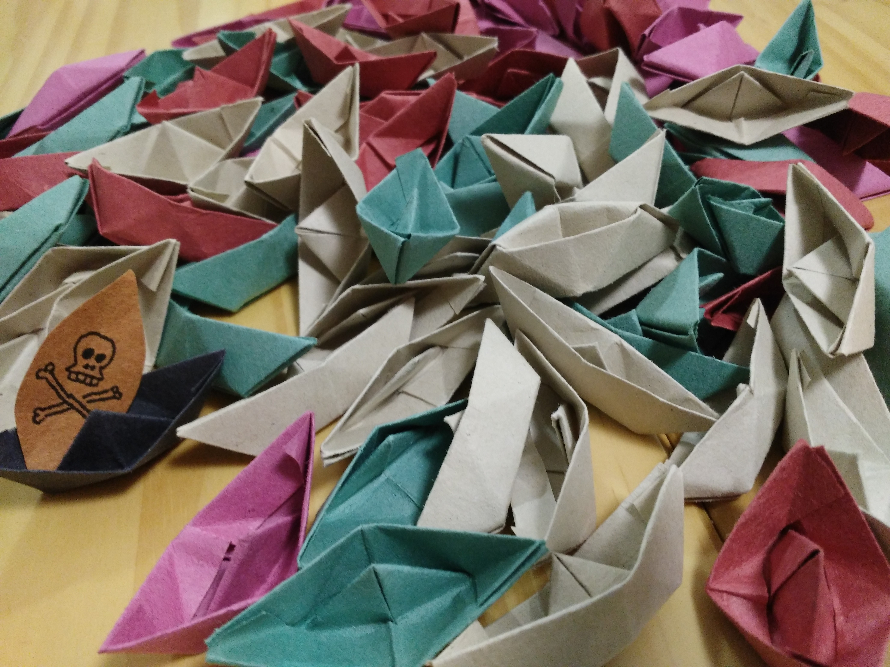

# WIP: Board Game

Combines elements from Catan, Carcassonne and Ticket to Ride, the well known board game triad.

# Changelog

## Version 0.1.0

## Version 0.2.0: pirates and buccaneers

## Version 0.3.0: Start designing tiles with Pirates theme. Built ships out of paper.

# Material

- Three decks
  - 84 Tiles of sea and islands.
  - ?? Cards of resources: wood, pepper, fish and goat.
  - ?? Cards of goals.
- 8 conquer peebles for each player.
- ?? boats.
- ?? pirates.

# Mechanics

## How many players?

2 to 5.

## How long should the game be?

Around one hour long.

## Starting

1. Shuffle both decks
2. Distribute 8 peebles and ?? markers for each player
3. Some player starts its turn

## Turn

Each player should do on its own turn:

- *(1)* Draw a tile from the deck and place it on a valid position (like Carcassonne)
  - If it's a resource tile (island), the player can place a peeble on it. The tile will can generate a resource in another step.
- *(2)* Roll the dice to generate resource cards for all players. If the dice gives a pirate, the player can place in any island it wants. The selected island will not generate resources until the pirate moves to another one (like Catan).
- *(3A)* Place boats on the sea *if* it has enough resource and match path/resource card (like Ticket to Ride).
  <!-- - A player can't place boats when islands have peebles of somebody else -->
- *(3B)* Buy a goal
- *(3C)* Buy an event
  - A point
  - An action to move the pirate
  - An action to steel resources
  - An action to sink boats

# Scoring

- Sum the points from goal cards and event cards, including the biggest road. The player with large amount of points wins the game.
